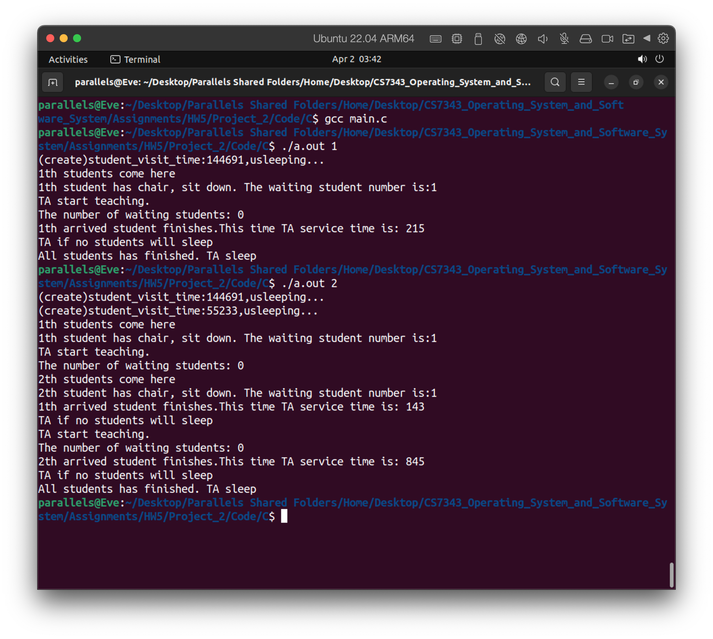
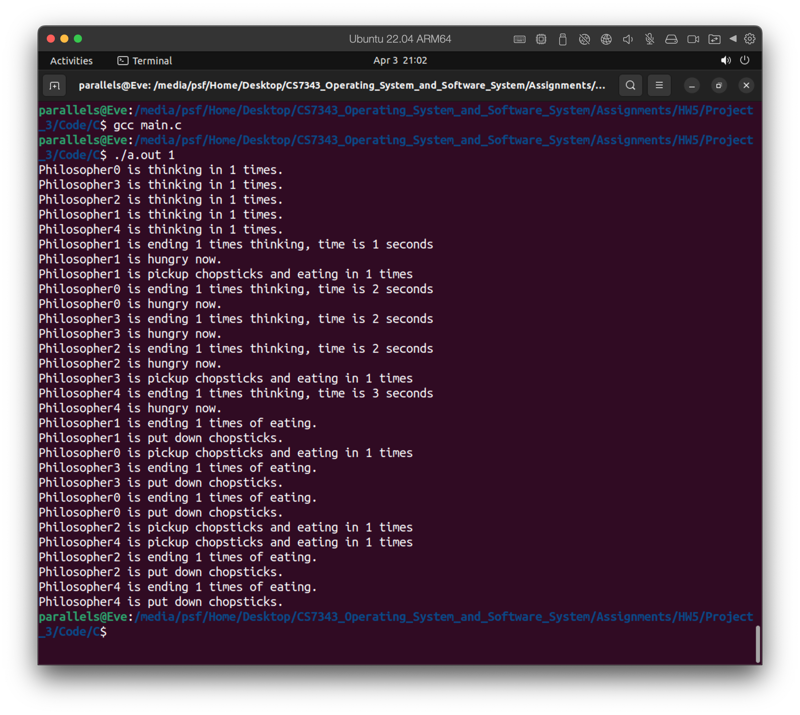
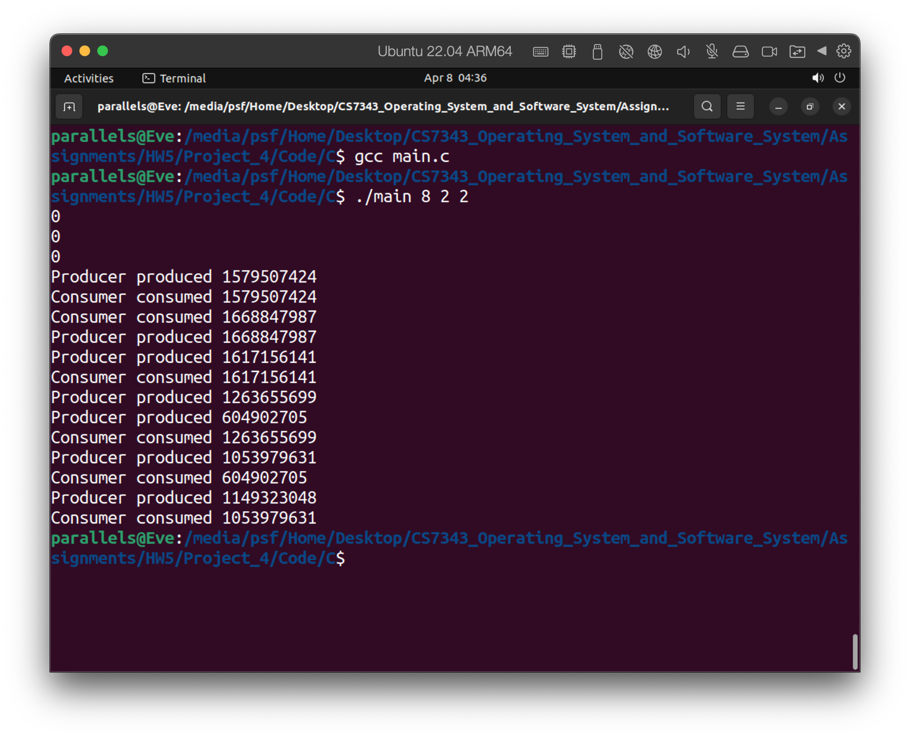

# README

Brief description of how to test the program

## Project 2 The Sleeping Teaching Assistant

`gcc main.c`

`./a.out <The number of students>`

For example:

## Project 3 The Dining-Philosophers Problem

`gcc main.c`

`./a.out <The times of philosopher eating>`

For example:

## Project 4 The Producer-Consumer Problem

`gcc main.c`

`./a.out <execute time> <producers number> <consumer number> `

For example: 