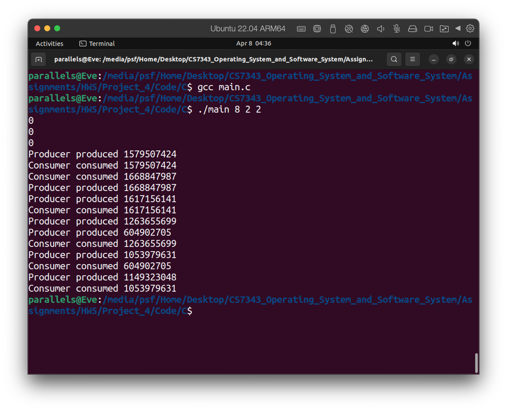

### Environment

CLion CLion 2022.2.3 Runtime version: 17.0.4+7-b469.53 aarch64
VM: OpenJDK 64-Bit Server VM by JetBrains s.r.o.
macOS 13.3
GC: G1 Young Generation, G1 Old Generation
Memory: 2000M
Cores: 8

Ubuntu 22.04 ARM64 Parallels Desktop as virtual environment.

## The Buffer
Internally, the buffer will consist of a fixed-size array of type `buffer_item` (which will be defined using a `typedef`). The array of `buffer_item` objects will be manipulated as a circular queue. The definition of `buffer_item`, along with the size of the buffer, can be stored in a header file such as the following: 
```c
/* buffer.h */
typedef int buffer_item;
#define BUFFER_SIZE 5
```

```c
// 
// Created by Eve Liang on 3/26/23.
//
/* buffer.h */
/* buffer fix array, statement of item; */
typedef int buffer_item;

/* The definition of the array size */
#define BUFFER_SIZE 5        

/* The operation in the buffer, separately used for producer and consumer thread */
int insert_item(buffer_item item);
int remove_item(buffer_item *item);

```

The buffer will be mainpulated with two functions, `insert_item()` and `remove_item()`, which are called by the producer and consumer threads, respectively. A skeleton outlining these functions appears in Figure 7.14
```c
#include "buffer.h"

/* the buffer */
buffer_item buffer[BUFFER_SIZE];

int insert_item(buffer_item item){
/* insert item into buffer
return 0 if successful, otherwise
return -1 indicating an error condition */
}

int remove_item(buffer_item *item){
/* remove an object from buffer
placing it in item 
return 0 if successful, otherwise
return -1 if indicating an error condition */
}
```

The `insert_item()` and `remove_item()` functions will synchronize the producer and consumer using algorithms outlined in Figure 7.1
```c
while (true){
	...
	/* produce an item in next_produced */
	...
	wait(empty);
	wait(mutex);
	...
	/* add next_produced to the buffer */
	signal(mutex);
	signal(full);
}
// The structure of the producer process.
```

and Figure 7.2
```c
while (true){
	wait(full);
	wait(mutex);
	...
	/* remove an item from buffer to next_consumed */
	...
	signal(mutex);
	signal(empyt);
	...
	/* consuem the item in next_consumed */
}
// The structure of the consuemr process.
```
The buffer will also require an initialization funciton that initializes the mutual-exclusion object `mutex` along with the `empty` and `full` semaphores.
The `main()` function will initialize the buffer and create the separate producer and consumer threads. Once it has created the producer and consumer threads, the `main()` function will sleep for a period of time and, upon awakening, will terminate the application. The `main()` function will be passed three parameters on the command line:
1. How long to sleep before terminatin
2. The number of producer threads
3. The number of consumer threads

command:
`./main <How long to sleep before terminantin> <number of producers> <number of consumers>`

A skeleton for the function appears in Figure 7.15
```c
// Outline of skeleton program

#include "buffer.h"

int main(int argc, char *argv[]){
/* 1. Get command line arguments argv[1], argv[2], argv[3] */
/* 2. Initialize buffer */
/* 3. Create producer thread(s) */
/* 4. Create producer consumer thread(s) */
/* 5. Sleep */
/* 6. Exit */
}
```

```c
//  
// Created by Eve Liang on 3/26/23.  
//  
#include "buffer.h"  
#include <stdio.h>  
#include <stdlib.h>  
#include <pthread.h>  
#include <semaphore.h>  
#include <unistd.h>  
  
#include "pcthreads.c"  
#include "buffer.c"  
  
#define TRUE 1  
  
int main(int argc, char*argv[]) {  
    /*  The `main()` function will be passed three parameters on the command line:  
        1. How long to sleep before terminatin        2. The number of producer threads        3. The number of consumer threads     */  
    /* 1. Get command line arguments argv[1], argv[2], argv[3] */    int sleepTime;  
    int n_producer;  // n_producer thread  
    int n_consumer;  // n_consumer thread  
    int i, j;  
    if (argc != 4) {  
        fprintf(stderr,  
                "Please use the command format: <How long to sleep before terminatin> <producer number> <consumer number>\n");  
        return -1;  
    }  
  
    sleepTime = atoi(argv[1]);  
    n_producer = atoi(argv[2]);  
    n_consumer = atoi(argv[3]);  
  
    /* 2. Initialize buffer */  
    pthread_mutex_init(&mutex, NULL);  
    sem_init(&empty, 0, BUFFER_SIZE);  
    sem_init(&empty, 0, BUFFER_SIZE);  
    srand(time(0));  
  
    /* 3. Create producer thread(s) */  
    for (i = 0; i < n_producer; i++) {  
        pthread_t tid;  
        pthread_attr_t attr;  
        pthread_attr_init(&attr);  
        pthread_create(&tid, &attr, producer, NULL);  
    }  
  
    /* 4. Create n_consumer thread(s) */  
    for (j = 0; j < n_consumer; j++) {  
        pthread_t tid;  
        pthread_attr_t attr;  
        pthread_attr_init(&attr);  
        pthread_create(&tid, &attr, consumer, NULL);  
    }  
  
    /* 5. Sleep */  
    sleep(sleepTime);  
  
    /* 6 Exit */  
    return 0;  
}
```

### The producer and Consumer Threads
The producer thread will alternate between sleeping for a random period of time and inserting a random integer into the buffer. Random numbers will be produced using the `rand()` function, which produces random integers between 0 and `RAND.MAX`. The consumer will also sleep for a random period of time and, upon awakening, will attempt to remove an item from the buffer. An outline of the producer and consumer threads appears in Figure 7.16.
```c
#include <stdlib.h> /* required for rand() */
#incldue "buffer.h"

void *producer(void *param){
	buffer.item item;
	
	while (true) {
		/* sleep for a random period of time */
		sleep(...);
		/* generate a random number */
		item = rand();
		if (insert_item(item))
			fprintf("report error condition");
		else
			printf("producer produce %d\n",item);
	}
}

void *consumer(void *param){
	buffer_item item;

	while (true){
		/* sleep for a random period of time */
		sleep(...);
		if (remove_item(&item))
			fprint("report error condition");
		else
			fprint("consumer consumed %d\n", item); 
	}
}
// An outline of the producer and consumer threads
```

```c
//  
// Created by Eve Liang on 3/26/23.  
//  
#include <stdlib.h> /* required for rand() */  
#include <unistd.h>  
#include <stdio.h>  
#include "buffer.h"  
#define true 1  
  
void *producer(void*param) {  
    buffer_item item;  
    while(true){  
        sleep(rand() % BUFFER_SIZE);  
        item = rand();  
        if(insert_item(item))  
            fprintf(stderr,"report error condition");  
        else            printf("Producer produced %d \n", item);  
  
  
    }  
}  
  
void *consumer(void *param){  
    buffer_item item;  
    while(true){  
        sleep(rand() % BUFFER_SIZE);  
        if(remove_item(&item))  
            fprintf(stderr, "report error condition");  
        else            printf("Consumer consumed %d\n", item);  
    }  
}
```

As noted earlier, you can sovle this problem using either Pthreads or the Windows API. In the following sections, we supply more information on each of these choices.


### Pthreads Thread Creation and Synchronization
Creating threads using the Pthreads API is discussed in Section 4.4.1. Coverage of  mutex locks and semaphores using Pthreads is provided in Section 7.3. Refer to those sections for specific instructions on Pthreads thread creation and synchronization.


### Results
The result for running the for 8 seconds with 2 producer and 2 consumer.