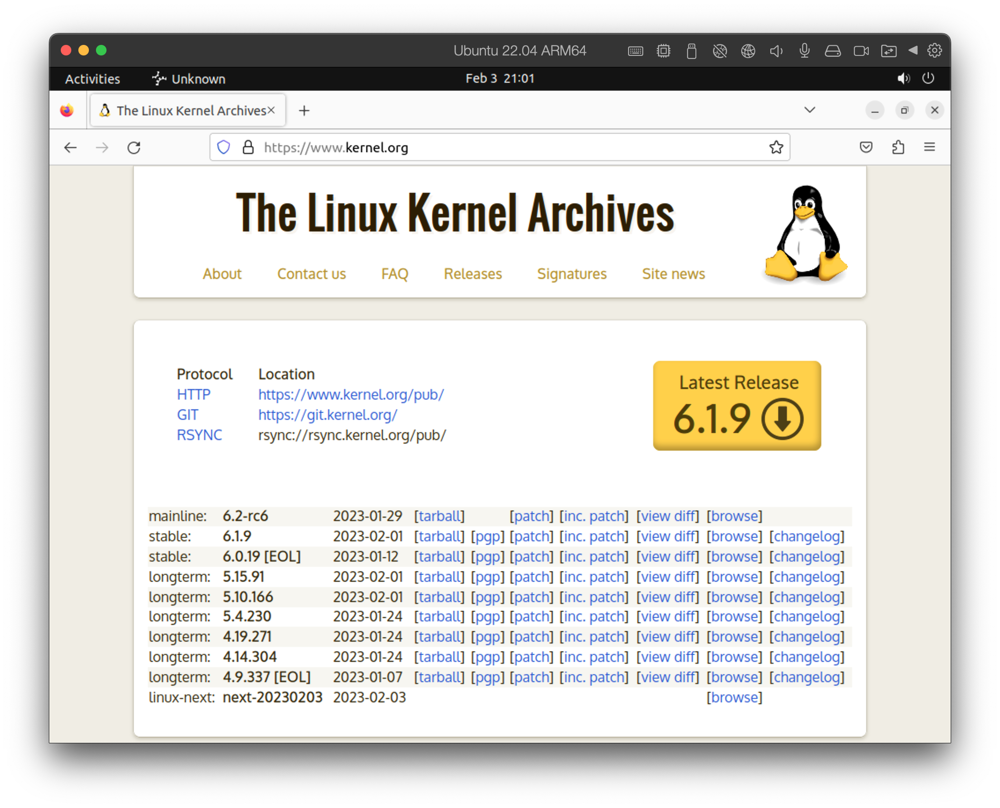

# How to build a Linux system from scratch

1. Download the Linux source code from http://www.kernel.org.

   

2. Configure the kernel using the `make menuconfig` command. This step generates the `.config` configuration file.
3. Compile the 