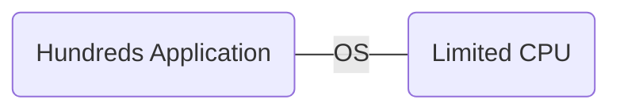
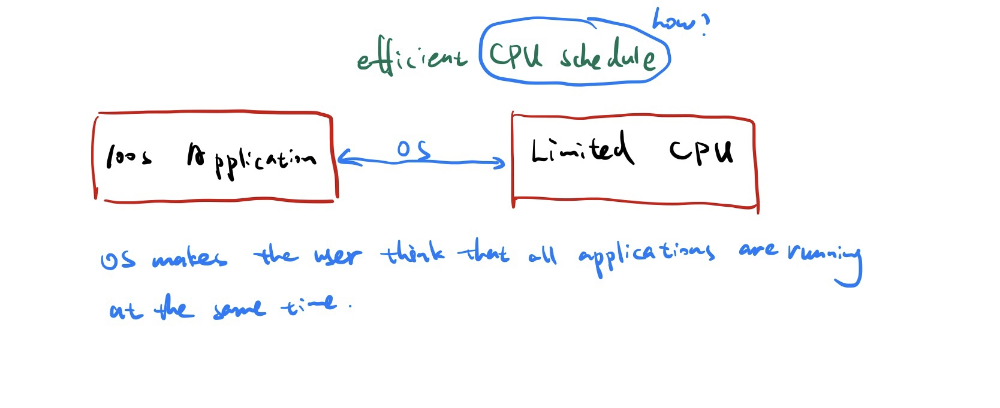
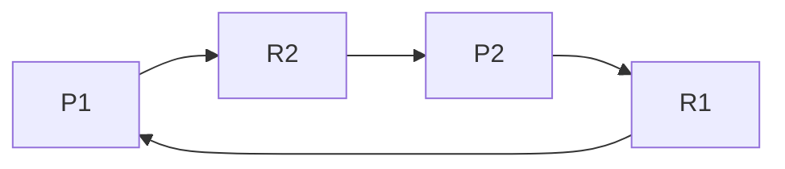
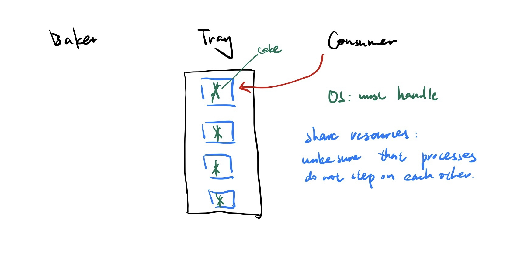

# Lecture 1

Jan-19-2023

Quick Tour of the contents that will be discussed in the course.

Reading assignments: Chapter 1, Chapter 2

### Operating System General Concepts

* What is OS
* History
* Important technology: 
  * Process
  * Thread
  * Concurrency
  * Processor
  * Synchronization
  * Deadlocks
  * Deadlocks Detection
  * Deadlocks Prevention
  * Deadlocks Avoidance
  * Semaphores
  * Monitors
  * Memory Management: Paging, segmentation
  * Virtual Memory
  * Storage Management
    * Mass - Strorage structure
    * I/O Systems
  * Security

### **What is Operating Systems?**

It is a software that works as an interface between the hardware and the end users. It abstracts any kind of interface so that the user need not be concerned with any hardware details (e.g file system, memory management, disk management, CPU usage) are handled by OS. The user only focuses on on his immediate task (programming + file reading, editing...). OS also manages the computer resources, such memory, Disk, Processors. Users write or use programs typically we have many many application that are competing for computer resources. 

> Outnumber */*ˌaʊtˈnʌmbər*/* *vt.*数目超过；比……多

#### **Multi-user environments**

Users application complete not only for memory but also on using the CPU.

OS makes the user think that all applications are running at the same time.

How doing by efficient CPU schedule? We'll be covering this during the course.

#### **Another OS responsibility is the following.**

Applicantion 1 is using a computer resoure R1

Process1: `A1 <- R1`, `A1 -> R2`

Process2: `A1 <- R2`, `A2 -> R1`

The graph called Deadlock. And in this situation, OS does three things, it can do

* **Deadlock detection**

  detect it here, oh we have a deadlock situation, we need to handle it.

* **Deadlock prevention**

  When a process asks for a file say for instance it has to do so through the OS, it can not just do it on its own. OS will decide right, if I give it to it will it create a deadlock. For instance right now the graph if the last request, OS will check whether it happen deadlock, it will deny. 

* **Deadlock avoidance**

  Avoidance something that might happen in the future it's not now, but in the future.

OS is to do synchronization and to make sure to handle this scenario. 

**Another issue that OS must address:** 

**managing + synchronization of shared resources.** 

Example:

We have five philosophers, they are sitting around the table. There are forks on their side, they have to use the both sides forks to eat. They don't synchronize anything amongst themselves whoever is hungry is gonna eat. We want to make sure that everybody gets a turn to eat, we want to make sure that nobody is going to be indefinitley waiting. In the OS we call this indefinite postponement. We also want to prevent Deadlocks.

The typical scenario is that each person is going to pick up forks.

Abstraction of philosophers: Processes

Abstraction of sapghetis and forks: Resources

scenarios: 

Baker        tray           Consumer

Whenever the baker want to put something if the tray is empty, then the consumer to take it. We want to synchronize the adding and taking out. 

OS: must handle.

It is share resources. make sure that processes do not step on each other.

**OS: Critical Sections**

Program 1: word document  (read/write)

Program 2: Youtube  (read only)

Two programs access the same resources and both are writing to it. We must synchronize access to this shared resources. 

Example:

shared file: that two processes are writing to at the same. 

The file is considered a critical section and access to it must Synchronized. This is done via OS. We could use semaphores or we could use monitor to synchronize access to this shared resource. We do in such a way so that we do not have a deadlock,  indefinite postponement( sometimes they call it in the OS terminology they don't count indefinite postponement, they call it starvation, which means eventually you should be able to access it). 

We do so, without the slightest assumption about the speed of the processor or the order in which the competing processes want to access the shared resouce. (We done by OS)

It's basically three things from the discussion 

* abstracting the interface between the user and hardware
* synchronization of resources
* managing resources
* do it in a very secure manner 

#### **OS Memory management** 

100 apps                     16GB

Apps must be taken up from RAM moved to somewhere else other apps are moved to RAM, get excuteds, swapped....(All these are done by OS)

Memory (RAM): Partition into pages, segments, supports my application is say 8GB, RAM is 16 GB.

Window Word is 8GB 

RAM: 16 GB

* youtube: 6 GB
* notepad: 2 GB
* firefox : 10 GB

paging replacement algorithms which page to replace (OS)

heuristics statistics the smart OS will look in the past and says what are the chances of this page that has been used in the past 

