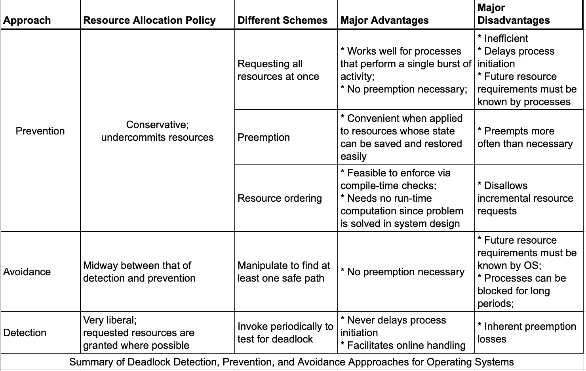
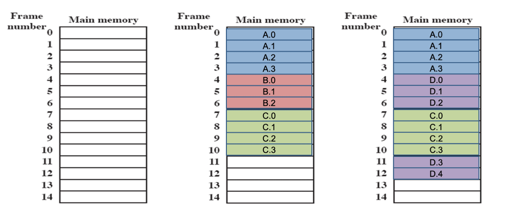

# Lecture 12

Apr 27, 2023

Ten questions

The homework 6 it's an exact copy of the exam that we did for good luck avoidance, same steps, different data.

 The exam will have questions about deadlocks. The exam will have questions about either deadlock avoidance or deadlock detection. 

 

Final Exam is Next Thursday.

Cheat sheets are allowed

Please contact the instructor if you need special assistance.

Today

Chapter 8 Deadlocks.

Chapter 9 Main Memory

9.1, 9.2, 9.3, 9.4, Important.

9.6, 9.7 Skip

9.8 Read

Many topics discussed in Lecture are not in textbook. (Chapter 9)

Main memory Managment.

### Review 

* Deadlock Definition
* Necessary and sufficient conditions for deadlock to happen.
* Deadlock prevention
* Deadlock avoidance
* Deadlock Detection

Necessary and conditions for Deadlock to happen:

1) Mutual Exclusion
2) Hold and Wait
3) No preemption

 These 3 conditions must all exist and are necessary but not sufficient.

That is even if they exist, does not imply that deadlock is inevitable. On the other hand if any one of these conditions does not hold, then Deadlock cannot occur. 

If we add another conditions to these previous conditions, then and if the four conditions hold, then deadlock is inevitable. 

1. Mutual Exclusion
2. Hold and Wait
3. No preemption
4. Circular wait

These 4 are necessary and sufficient conditions for deadlock to occur.

Dealing with Deadlocks

1. Deadlock Prevention  -> make sure one of the necessary + sufficient conditions for deadlock is false. 
2. Deadlock Avoidance -> If a proces requests a new resource, determine if granting it request will not result in an unsafe state.
3. Deadlock Detection

If a process request a set of resources, the OS will grant any kind of requests , but periodically scans the and determines if the system is deadlocked. If so the OS must take a drastic action as to break the deadlock(e.g. aborting a process or possibly more). The action is up to the OS Designer. 

* Deadlock Prevention -> Present tense
* Deadlock avoidance    -> Future tense 
* Deadlock Detection  -> Past tense 

### Deadlock Detection

1. Mark P4, because P4 has no allocated resources.

2. Set W = (0  0  0  0  1)

3. The request of process P3 is less than or equal to W, so mark P3 and set W = W +(0 0 0 1 0) = (0 0 0 1 1).

4. No other unmarked process has a row in Q that is less than or equal to W.

   Therefore, terminate the algorithm.

The algorithm concludes with P1 and P2 unmarked, indicating that these processes are deadlocked.

So we process P3, and then the P3 finish.  The Allocation vector will be 00001. And then we are stuck. OS will have to kill them.

==Final:== 

### Advantages and Disadvantages

Understanding them instead of memorizing. You have to correct them.

### Chapter 9 Memory Management

Recall: OS is all about management of resources + synchronization.

Resources: CPU, Processor discussed. 

Several ways of managing CPU usage: FIFS, RR - - - - - 

Now next most important resources is

Main Memory: No matter how large main memory, it is still considered a scarce resources.

Why?

Because the more memory we have, the higher the number of processes we want to run and also the more  hungry the processes are for memory. Hence OS must do Memory Management. 

We can do in two ways:

1. old fashioned way:  partitioning, paging, sgementation

2. Fancy fashion: Virtual Memory, Sky is the limit.

   ​							--> Give us the impression that main memory is unlimited

   

Few new concepts:

1) Frame: a fixed block of main memory. 1K 
2) Page: a fixed length block that resides in secondary memory.
3) Segment: is a page with each page has a variant size. 

Page has associated with it:

1. start address of the page + fixed length

segment: base address + length of segment.

#### Memory Management:

1. Relocation
2. Protection
3. Sharing

4. Logical Organization -> User
5. Physical Organization  -> OS 

Memory Management

* old fashion:  -> Frames, pages, segmentation, partitioning 
* new fashion:  -> Virtual Memory 

##### Partitioning :

 (Old fashion)

* Fixed partitioning
* dynamic partitioning
* Simple paging
* Simple segmentation

 (fancy way)

* Virtual Memory paging
* Virtual Memory Segmentation

#### Fixed Partition:

Fixed Partition: Historic, but nobody use it, it will help us. 

: Divide main memory into equal-size partitions.  A process whose size is less than or equal to the partition size can be loaded into an available partition.

Bad. Why? 

1) A program might be big. 

2) Use of memory is inefficient. 

Fixed Partitioning:

* Equal-size partitions
  * Any process whose size is less than or equal to the partition size can be loaded into an available partition
* The operating system can swap a process out of a partition
  * If none are in a ready or running state

#### Solution - Unequal Size Partitions

* Lessens both problem
  * but doesn't solve completely
* In Fig 7.3b
  * Programs up to 16M can be accommodated without overlay
  * Smaller programs can be placed in smaller partitions, reducing internal fragmentation

#### Placement Algorithm

* Equal-size
  * Placement is trivial (no options)
* Unequal-size
  * Can assign each process to the smallest partition within which it will fit
  * Queue for each partition
  * Processes are assigned in such a way as to minimize wasted memory within a partition

#### Fixed Partitioning

#### Remaining Problems with Fixed Partitions

* The number of active processes is limited by the system
  * I.E limited by the pre-determined number of partitions
* A large number of very small process will not use the space efficiently
  * In either fixed or variable length partition methods

#### Dynamic Partitioning

* Partitions are of variable length and number

* Process is allocated exactly as much memory as required

* Example: 

  * ***External Fragmentation***
  * Memory external to all processes is fragmented
  * Can resolve using **compaction**
    * OS moves processes so that they are contiguous 
    * Time consuming and wastes CPU time

  

  Imagine a system with 64M RAM

  

  

  1. Initially, main memory is empty, except for the operating system
  2. Three processes are loaded in - leaving a 'hole' too small for any further process
  3. At some point, none of the processes in memory is ready. the operating system swaps out process 2.
  4. Which leaves sufficient room to load a new process, process 4 - but that creates another hole
  5. Later, a point is reached at which none of the processes in main memory is ready, but process 2, in the Ready-Suspend state, is available. Because there is insufficient room in memory for process 2, the operating system swaps process 1 out and swaps process 2 back in leaving yet another hole.
  6. Explain external Fragmentation and compaction - mention that compaction implies the capability of dynamic relocation.

* Operating system must decide which free block to allocate to a process
* Best-fit algorithm
  * Chooses the block that is closest in size to request
  * Worst performer overall
  * Since smallest block is found for process, the smallest amount of fragmentation is left
  * Memory compaction must be done more often

* First-fit algorithm

  * Scans memory form the beginning and chooses the first available block that is large enough
  * Fastest
  * May have many process loaded in the front end of memory that must be searched over when trying to find a free block

* Next-fit

  * Scans memory from the location of the last placement
  * Move often allocate a block of memory at the end of memory where the largest block is found
  * The largest block of memory is broken up into smaller blocks
  * Compaction is required to obtain a large block at the end of memory

  

Example: memory configuration after a number of placement and swapping-out operations.

* The last block that was used was a 22-Mbyte block from which a 14-Mbyte partition was created.
* Figure 7.5b shows the difference between the best, first, and next-fit placement algorithms in satisfying a 16-Mbyte allocation request.
* Best-fit will search the entire list of available blocks and make use of the 18-Mbyte block, leaving a 2-Mbyte fragment.
* First-fit results in a 6-Mbyte fragment
* Next-fit results in a 20-Mbyte fragment

Next fit you don't go back, so it is probably faster. But that does not necessarily guarantee that you will find the best fit.

In the final, this will be shuffle, and switch them and ask you to fix it.

Next Fit说的是什么呢？这个策略和First Fit很相似，是说我们别总是从头开始找了，而是从上一次找到合适的空闲内存块的位置找起，老爷子观察到上一次找到某个合适的内存块的地方很有可能剩下的内存块能满足接下来的内存分配请求，由于不需要从头开始搜索，因此**Next Fit将远快于First Fit**。

https://www.geeksforgeeks.org/program-for-next-fit-algorithm-in-memory-management/

https://blog.csdn.net/tjcwt2011/article/details/125291335?spm=1001.2101.3001.6661.1&utm_medium=distribute.pc_relevant_t0.none-task-blog-2%7Edefault%7ECTRLIST%7ERate-1-125291335-blog-52053183.235%5Ev32%5Epc_relevant_default_base3&depth_1-utm_source=distribute.pc_relevant_t0.none-task-blog-2%7Edefault%7ECTRLIST%7ERate-1-125291335-blog-52053183.235%5Ev32%5Epc_relevant_default_base3&utm_relevant_index=1

In a fixed partitioning scheme limits the number of active processes and may use space inefficiently if there is a poor match between available partition sizes and process sizes. 

A dynamic partitioning scheme is more complex to maintain and includes the overhead of compaction.

An interesting compromise is the buddy system.

### Buddy System

* Entire space available is treated as a single block of $2^U$
* If a request of size $s$ where $2^{U-1} < s <= 2^U$
  * entire block is allocated 
* Otherwise block is split into two equal buddies
  * Process continues until smallest block grater than or equal to $s$ is generated

Figure 7.6 gives an example using a 1-Mbyte initial block.

The first request, A is for 100 Kbytes, for which a 128K block is needed.

* The initial block is divided into two 512K buddies.
* The first of these is divided into two 256K buddies, and the first of these is divided into two 128K buddies, one of which is allocated to A.
* The next request B,  requests a 256K block. Such a block is already available and is allocated.
* The process continues with splitting and coalescing occurring as needed.
* Note that when E is released, two 128K buddies are coalesced into a 256K block, which is immediately coalesced with its buddy.

Tree Representation Buddy System.

The leaf nodes request the current partitioning the memory.

If two buddies are leaf nodes, then at least one must be allocated; otherwise they would be coalesced into a larger block.

* The buddy system is a reasonable compromise to overcome the disadvantages of both the fixed and variable partitioning schemes.
* But in contemporary operating systems, virtual memory based on paging and segmentation is superior.
* However, the buddy system has found application in parallel systems as an efficient means of allocation and release for parallel programs. A modified form of the buddy system is used for UNIX kernel memory allocation (described in Chapter 8).

### Relocation

* When program loaded into memory the actual (absolute) memory locations are determined
* A process may occupy different partitions which means different absolute memory locations during execution
  * Swapping
  * Compaction

### Addresses

* Logical 
  * Reference to a memory location independent of the current assignment of data to memory.
* Relative
  * Address expressed as a location relative to some known point.
* Physical or Absolute
  * The absolute address or actual location in main memory.

A translation must be made from both Logical and Relative addresses to arrive at the Absolute address

#### Relocation

Base Register: Mockingbird.

Relative address: two blocks

BoundsRegister: you don't go out of bounds.

### Registers Used during Execution

* Base register
  * Starting address for the process
* Bound register
  * Ending location of the process
* These values are set when the process is loaded or when the process is swapped in.
* The value of the base register is added to a relative address to produce an absolute address
* The resulting address is compared with the value in the bounds register.

Q: Why is it program data and stack?

A: Any program that you write, which we call a process, a process is a program in execution, what is running. Whether you do it explicitly or not, it has three components, the executable itself. An array of five elements or string s or you were defining a new objects. That's called data. And if you are writing Java or you are writing C++, you have functions. And you call these functions or you call them methods. Every time you call the method, the everything is stored somewhere temporarily. That's you call that user stack. So by default, any process must have three components.

Program: The executable which what you see

Data: you have defined or declared.

Stack: temporary you store your addresses and so forth when you call a function.

99% of the virus are happening in stack.

### Paging

* Partition memory into small equal fixed-size chunks and divide each process into the same size chunks
* The chunks of a process are called **pages**
* the chunks of memory are called **frames**

* Operating system maintains a page table for each process
  * Contains the frame location for each page in the process
  * Memory address consist of a page number and offset within the page

pages and segmentation is for process. So each process what we are going to do is divide the main memory into equal partitions like before each one of them is called the frame.

### Processes and Frames

1. System with a number of frames allocated
2. Process A, stored on disk, consists of four pages. When it comes time to load this process, the operating system finds four free frames and loads the four pages of process A into the four frames.
3. Process B, consisting of three pages, and process C, consisting of four pages, are subsequently loaded.
4. Then process B is suspended and is swapped out of main memory
5. Later, all of the processes in main memory are blocked, and the operating system needs to bring in a new process, process D, which consists of five pages. The Operating System loads the pages into the available frames and updates the **page table.**

Process A needs 4 frames from 0 to 3.

The challenge is how do you map pages into frames. Because remember pages for secondary storage, frames are for main memory.

--> page table

The page table tells me where in my memory. 

### Page Table

I don't need to contiguous any more. Why? 

Because I have page table that tells me exactly what frame is. It will map my page into frame. Now, that's a little bit more of flexibility here.

### Segmentation

* A program can be subdivided into segments 
  * Segments may vary in length
  * There is a maximum segment length
* Addressing consist of two parts
  * A segment number and 
  * An offset
* Segmentation is similar to dynamic partitioning

The difference with dynamic partitioning, is that with segmentation a program may occupy more than one partition, and these partitions need not be contiguous.

Segmentation eliminates internal fragmentation but suffers from external fragmentation (as does dynamic partitioning)

However, because a process is broken up into a number of smaller pieces, the external fragmentation should be less.

A consequence of unequal-size segments is that there is no simple relationship between logical addresses and physical addresses.

Analogous to paging, a simple segmentation scheme would make use of a segment table for each process and a list of free blocks of main memory. Each segment table entry would have to give 

* the starting address in main memory of the corresponding segment.
* the length of the segment, to assure that invalid addresses are not used.

When a process enters the Running state, the address of its segment table is loaded into a special register used by the memory management hardware.

#### Logical Addresses

In this example , 16-bit addresses are used, and the page size is 1K = 1024 bytes

The relative address 1502, in binary form, is 0000010111011110.

With a page size of 1K, an offset field of 10 bits is needed, leaving 6 bits for the page number.

Thus a program can consist of a maximum of $2^6 = 64$ pages of 1K bytes each.

As Figure 7.11b shows, relative address 1502 corresponds to 

* an offset of 478(0111011110) on page 1 (000001)
* which yields the same 16-bit number 0000010111011110.

Consider an address of $n + m$ bits, where the leftmost $n$ bits are the segment number and the rightmost $m$ bits are the offset.

In the example,

* n = 4 
* m = 12

Thus the maximum segment size is $2^{12} = 4096$

The following steps are needed for address translation:

* Extract the segment number as the leftmost $n$ bits of the logical address.
* Use the segment number as an index into the process segment table to find the starting physical address of the segment.

Compare the offset, expressed in the rightmost $m$ bits, to the length of the segment. If the offset is greater than or equal to the length, the address is invalid.

The desired physical address is the sum of the starting physical address of the segment plus the offset.

#### Paging

Example: 

we have the logical address 0000010111011110, which is page number 1, offset 478

Suppose that this page is residing in main memory frame 6 = binary 000110.

Then the physical address is frame number 6, offset 478 = 0001100111011110.

#### Segmentation

In the example: we have the logical address 0001001011110000, which is segment number 1, offset 752

Suppose that this segment is residing in main memory starting at physical address 0010000000100000.

Then the physical address is 0010000000100000 + 001011110000 = 0010001100010000