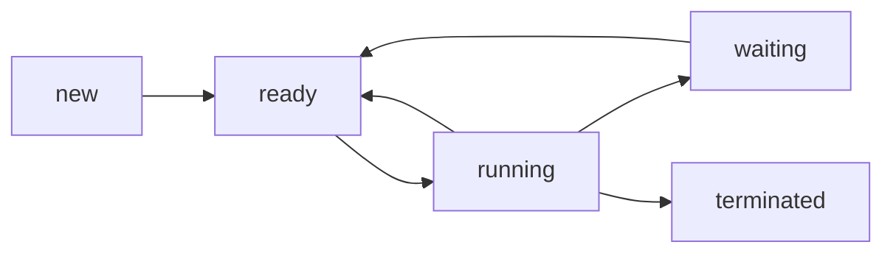
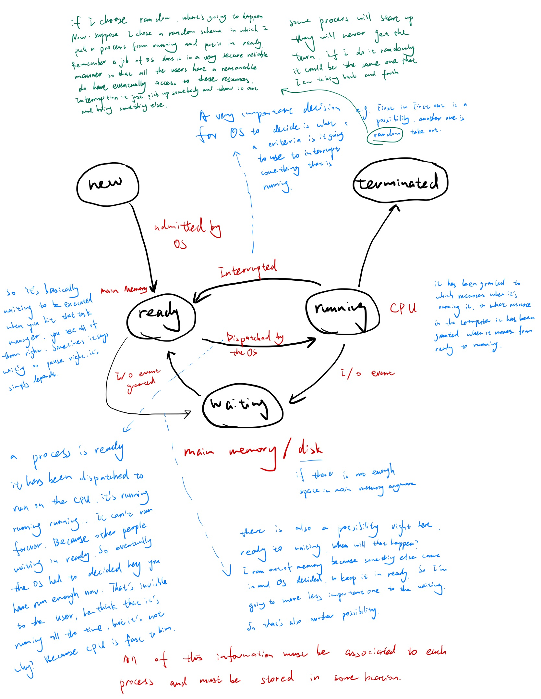
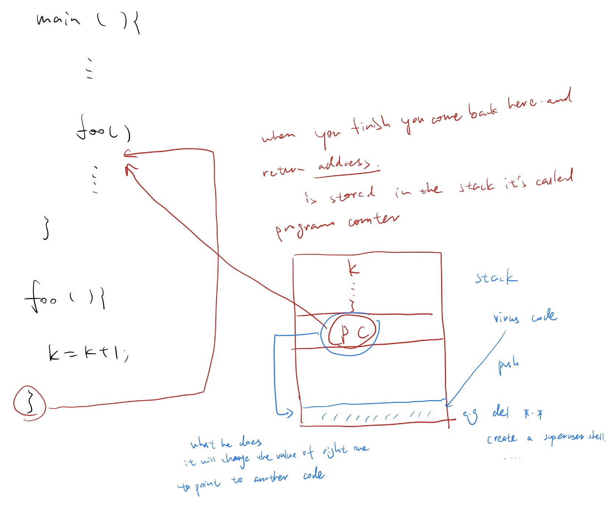
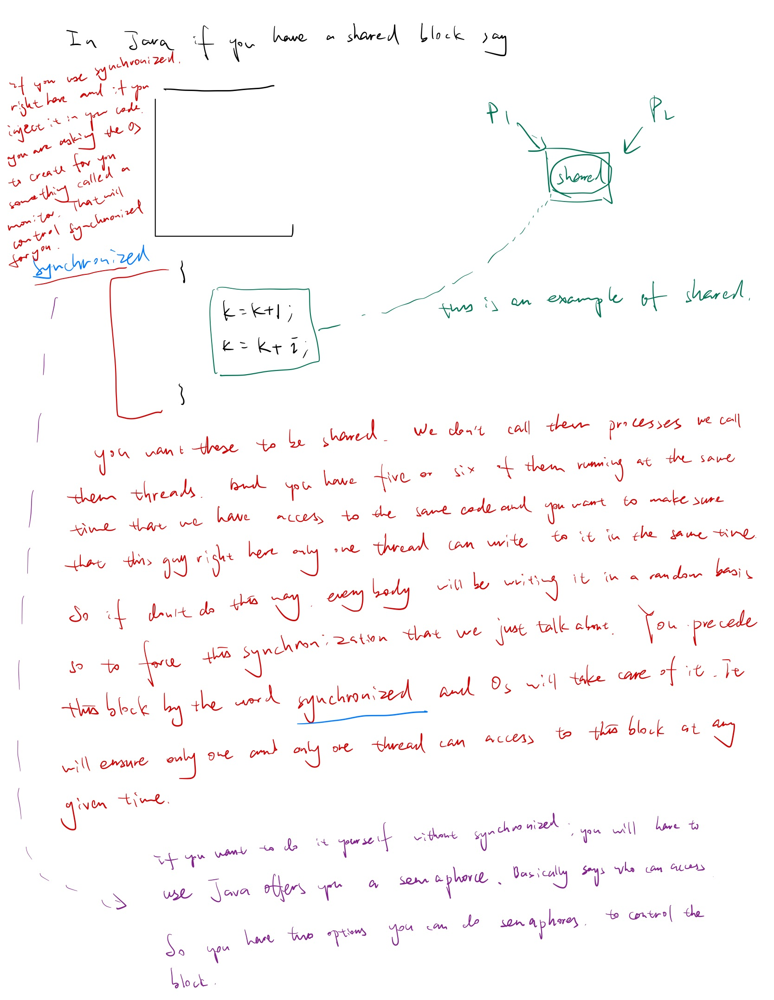
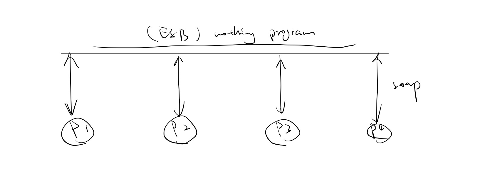
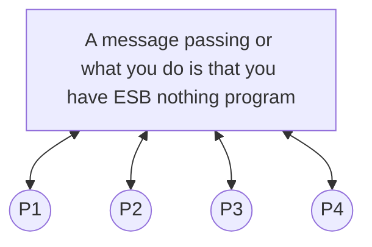
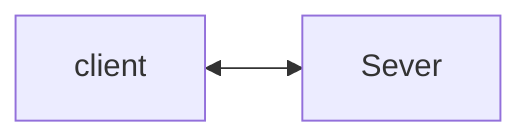
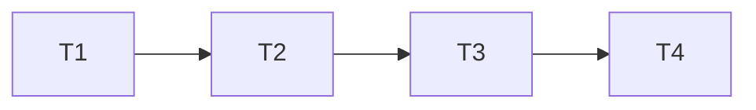
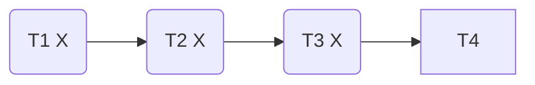

# Lecture 2

Jan-26-2023

* Homework 1 will be posted this weekend, possibly before
* Once Grader is found, a message will be sent on Canvas


Reading chapter 1, 2

Chapter 3


### Review: Definition of OS

####**What is the main objectives of OS**?

Basically: **OS** is a program/process whose responsibility is to manage and control access to computer resources in an efficient and secure manner ensuring that all users have access to these resources in a reasonable amount of time. OS acts also as an interface that hides all the complexity of the hardware from the user and gives the impression to the user that they have infinite computer resources available to them. One of the most fundamental concepts in OS design is **Process.**

## Chapter 3  Processes

**Process Definition**: A program in execution. 

**<u>Processes</u>** 

* Process concept
* Process scheduling 
* Operation on Processes 
* Process Communication 

### **How does a process look in memory while being executed?** 


When a user submits a program/application to be executed this program becomes a process the OS manages. This process you could be in any of the following states:

* User submits the process -> new 
* OS starts executing -> running 
* OS decides to make wait -> waiting 
* OS puts it in a queue to be executed -> ready
* OS decides to stop it -> terminated 







All of these information must be associated to each process and must stored in some location.

That is: stack location, heap location, process state, program counter...... registers allocated to the process, ......etc. All must be stored in some Location/Block. Call this location. **Process Control Block (PCB)** where all information related to Process are stored.

### **Why do we need PCB?**

Process can be preempted and moved to waiting queue on Disk and then will be eventually moved back to the read queue and then to the running state.

**Where do you think most of the hacking and the software attacks happen? If somebody want to inject a malicious code where is it more likely to go ?**


Executable code: this is like a read only so you don't have much of things and you cannot modify it or as you knows it will set those bits to zero so nobody can write to it even the super user cannot write to it. So heap either the data or the stack. 

a malicious virus is not worm because the worm is has its own executable so it's like a virus meaning 

the difference between a worm and a virus 

a worm is a complete code that can run on its own doesn't need any help 

a virus is it has to be attached to something else in order for it to run, if you store a virus on your disk it's harmless. If you store a virus on your USB it is harmless it's only when it gets attached to say Microsoft Word document or PowerPoint or anything that has exe that's where it becomes vicious otherwise it's just a piece of nothing. **So if you do a virus where would you do it?**

**Stack.** It's 99% of the attacks may happen here. They basically forced the there is ways to force your malicious code into the stack and you put it in somewhere in here. As we know whenever we call a function or a method. If you call a function or a method from your main program. The return address for where you called has to be stored onto the stack. It's called the program counter right and once you finish executing that function that address would be popped from the stack will be stored in the program counter and it will basically go back to where you left off.

For example:

```
main(){
...        // write some code 
	foo()      // call the function foo
					<----------------|       // once you finish control comes back here 
}													 |			 // this return address is stored in the stack it's 
													 |			 // called program counter 
													 |
foo(){										 |	
	k = k + 1;               |
} -------------------------
```



### **Process Communication:**

#### Interprocess Communication:

* **shared memory**

  Shared memory is do typically done when two or more processes share a common memory location in which one or more process can read/write to this location. We call this tight process communication.

* **Messsage passing**

  Message passing where processes communicate via sending/receiving messages in a synchronous manner, typically done via **Enterprise Service Bus (ESB)**. 

Message passing is most of way of process communication, in practice. Share memory access is fastest but difficult to implement because it requires process synchronization. Message passing is easier, expandable but slower.


 ```mermaid
 graph TD;
 P2 --> shared(Shared Memory)
 P1 --> shared
 ```

P1, P2 run independently of each other. P1 can write any time, P2 can do the same. Obviously they can step on each other that's where the whole thing synchronization happens. 

Message passing is a synchronous, you can send anytime you want. Obviously here we have to control who can write when. Obviously because you don't want them both of them to be writing at the same time. That's why we're gonna have semaphores and monitors and all of this here. 









Both of them P1, P2, P3, P4 can send and receive messages. So the message get sent across this Enterprise service bus which is nothing but a program that you can download and basically configure it and use it. 

The type of architecture is the above picture called SOA (Service Oriented Architecture). It's very common architecture used in industry. We call the ESB middleware. It's basically the one that sits in the middle between these guys like P1, P2, P3, P4. You basically take your information and you wrap them what is call soap and you send it across. It's a standard way of representing your data and anybody can listen to it and they can do anything they want with it.

Enterprise service bus example： tibco, MQ, mulesoft esb... they typically call them middleware. tibco is probably the most common giant huge multi-milion thing. That's an example it's called middleware. 

### **Programming Language History**

* Early 1940: No programming Language. No assembly language as well. Only machine code 00110010101....

* 1950's: assembly language was introduced. (assembler transfer to the machine code **==assembler -> machine code==**)

  High level Programming Language generated for scientific application: **==FORTRAN (formula translator)==** 

  It is one of most efficient languages so that's the 1950s. In that time, it's also advancement in complier design.

  Job of a compiler design is: take something from a high level language and translate it into machine code.

  More human readable and human understood. Compiler design is 2nd hard design, operating system design is the most hard thing. 

  Lex/YACC... : All what you do you give it your grammar of the language and says I want you to generate for me a Fortran complier and it will do it for you and you will get the whole compiler. It's probably your code is going to be a few hundred pages and in few days you have your own compiler. 

  * Lex: stands for lexical analyzer, another way of saying it is scanner 

  * YACC: is another compiler compiler. 


Languages when you are writing Java or C sharp what you are doing you call it a program. Another way of rephrasing the same thing is that you wrote a sequence of characters called string that belongs to the Java language or C sharp language, the lexical analyzer will be able to tell if that string belongs to a Java or that belongs to a C sharp. It only says yes or no. Semantically it could be wrong but syntactically it is right.

semantically: 语义地(不能理解为grammar, 因为会有歧义，而此处就是为了避免歧义，e.g. Jim)

syntactically: 在语句构成上

For example: In Java syntactically correct, but semantically is wrong

```java
int x; 
x = x + 1;   // √

// what if I do this 
x = x + system.out.println(5);// semantics says no this is not really a possibility
x = x + foo(5);     // syntactic is fine, lex will think system.out.println is a function.

x + 1 = x; // syntactic is correct
					 // semantics says no, left hand saide must be what an identifier 

// above things lexically this is correct okay 
// but YACC says no
```

Jim Said that Jim brought his book. (ambiguous)

Whose book is it ? Two Jim. 

C --> C++ --> Java --> C#

They have a lot of similarities.

* Java and C#: support or have ways for process to access shared data. (Build in) 

  There are two ways of doing it:

  1. Monitor: Easy to do 
  2. Semaphores: difficult to use and could result in programs that never terminated but give fine control.

* C: did not.

* C++: you could do so using add-on packages, such as pthread

For example: 

```java
foo (int J)  // synchronized; this is an example of monitor 
{
  k = J + 1;    // assume K shared

}

// if you don't want to use a monitor and you want to use semaphores, the control must be done explicitly. So you will have a foo as before
foo(){
  					<-----|
                  | 
  k = J + 1;  	// but here we put semaphore operations 
					 				|	
  					<-----|
}
```

Process will here have exclusive access to foo which means no two processes can access the variable K at the same time.


**Process Communication **: in the client sever systems (client server architecture: e.g. web amazon.com )



There is a server right here big one giant and there's a client here and they are communicating basically together. There are different ways of communicating: 

* (1) Sockets
* (2) RPC : Romok Procedor calls 
* (3) Pipes
* (4) RMI : remote method invocation

These things are in the chapter3

## Chapter 4 Threads & Concurrency

**Threads**: Processor have two features

* (1) Resource ownership they have dedicated ownership of their resources 

* (2) Scheduling/ Execution: Each process has its own path of execution. 

Typically, we would like the process to cooperate. We can do so by having them share memory or do message passing. 

**==Processes (threads)==** in OS are heavy weights and require a lot of overhead and management. 

Better: if we can have light weight <u>processes</u> that can cooperate with **==low overhead==**. We don't call them processes anymore we call them Threads.

Thread is a hight weight Process.

Java + $C_\#$ have built in feature for defining threads.


a process can spawn other threads that inherent the same shared variables as the parent process, typically,  these threads works to complete a common goal set by parent process or do different tasks in the same time. 

For example:


As soon as you click add new tab here, you are creating another thread right here


The parent process of these thread is the close button. 


If I kill the parent right here everybody goes, but I could kill one thread(remove one tab at a time)


Example: Using threads in sorting algorithms 

Quicksort 


Advantages: 

**Threads have less overhead than Processes. Threads can communicate with each other efficiently.**

Examples: suppose we have a list of a set of threads working together to sort a list of numbers. 

```
Sort(){
	...
	threads working on the sorting  // T1, T2 
																	// T3, T4 
																	
}
```

T1, T2, T3, T4 work together. Let's say that each thread is going to sort one fourth of the list and they are running while independently, each one has his own subset and they're working on it. Let's suppose that T1 is finished first 

Lets suppose 



So T1 finish first, T2 finish first, T3 finish first, but I have no idea about T4, we have to wait for T4



```
Sort(){
	...
	threads working on the sorting  // T1, T2 
																	// T3, T4 
	// T1 x; T2 x; T3 x;																	
} so do I exit here or wait until everybody is done?
```


```
Sort(){
	...
	threads working on the sorting  // T1, T2 
																	// T3, T4 
	// T1 x; T2 x; T3 x;			
  // right here I will have a function called Thread.Join(): meaning wait until everybody is 
  // done before you exit this list
} 

// This is an example of threads communicating with each other
// Processes cannot do that
```

$\theta(n)$

