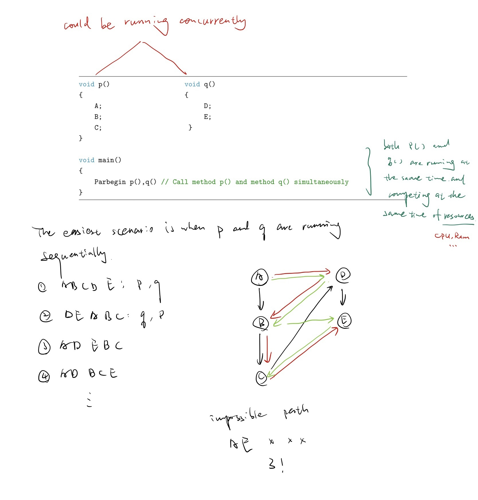
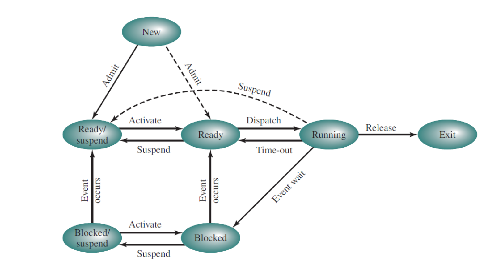

# Lecture 3 

Feb 9, 2023

Feb 2, 2022 was canceled due to inclement weather.

Order of important

Note, PPT, Textbook


Chapter 3

3.1; 3.2; 3.3; 3.4 Importent

3.5; 3.6 Read

3.7; 3.8; 3.9 Skip


Chapter 4

4.1; 4.2; 4.3 Important

4.4; 4.5; 4.6; 4.7; 4.8 Read


Chapter 5

5.1; 5.2; 5.3;  5.4 Important

5.5; 5.6; 5.7; 5.9 Read

5.8 skip 

## **Hw2**

### Problem 2



a.

The easiest scenario is when `p` and `q` are running sequentially.  

1. A B C D E : p, q

2. D E A B C : q, p

3. A D E B C 

4. A D B C E 

   ...

b. 

Impossible path: A E x x x

3!


### **problem 5** 



It's a process state diagram.

State Definition

**New:** a user submits a new application to start 

**Ready:** The Process is in main memory, and available for execution. It does not have a possession of the processor yet. In other words it is ready but waiting on a turn to run on the CPU. 

**Blocked:** The process is in main memory and waiting for an event. (waiting for some input or output or some I/O operation). 

**Blocked/suspend :** The process is in disk and waiting an event.  

**Ready/suspend:** The process is in disk, but available for execution as soon as it is loaded into main memory.


In term of who/which, state is closest to be running under normal circumstances:

(1) Running state

(2) Ready 

(3) Blocked 

(4) Ready/suspend (This ready here there's basically there is nothing is liking stopping, I'm ready just give me the CPU, you take off me from memory)

(5) Blocked/suspend (This guy is waiting for something to happen which could take forever)

Here are assuming that all the processes are equal, but sometimes processes do have priorities and that will affect the order obviously.  


### **Problem 1**

The key word Parbegin indicates that both calls to the function total are executed concurrently. Determine the proper lower bound and upper bound on the final value of the shared variable tally output by this concurrent program. Assume processes can execute at any relative speed and that a value can only be incremented after it has been loaded into a register by a separate machine instruction. You must explain how you’ve arrived to the final answer.

```pseudocode
const int n = 50;
int tally;
void total()
{
    int count;
    for (count = 1; count <= n; count++){
        tally++;
    }
}

void main()
{
    tally = 0;
    Parbegin (total (), total ());
    write (tally);
}
```

1) tally is the only shared valuable.
2) The constant n is read only and its thread safe.
3) The valuable count is local to the function `total()` and hence each thread has its
   own copy of the valuable count.
4) The statement `tally++` is the one that must addressed. Because `tally++ → tally =
   tally + 1`; and tally is shared valuable and is accessible by both threads. 

Solution:

1. Max value of tolly is 100 occurs when the two threads run in a seque.. manner.
2. Min Value is tally = 2

```assembly
(1) lw R0, tally
(2) add R0, 1
(3) sw R0, tally
```

And can treat the first total() as Thread A, and the second total() as Thread B. And
the process in the following:
**A:** tally = 0, R0 = 0
(1)R0 = 0 (2)R0 = 1 ... | suspend (3)
n = 1 (The thread A (3) has not finished yet. The thread turns to B)

**B:** tally = 0, R0 = 0
(1)R0 = 0 (2)R0 = 1 (3)tally = R0 = 1 . . . (1)R0 = 48 (2)R0 = 49 (3)tally = 49
n = 49 (The thread turns to A)

**A:** tally = 49, R0 = 1
(3)sw R0, tally → tally = 1
n = 1 (The thread turns to B)

**B:** tally = 1, R0 = 0
(1)R0 = 1 (2)R0 = 2 suspend (3)
n = 50 (The thread B (3) has not finished yet. The thread turns to A)

**A:** tally = 1, R0 = 0
(1)R0 = 1 (2)R0 = 2 (3)tally = R0 = 2 . . . (1)R0 = 49 (2)R0 = 50 (3)tally = R0 = 50
n = 50 (The thread A has finished. The thread turns to B)

**B:** tally = 50, R0 = 2
(3)tally = R0 = 2
n = 50 (The thread B has finished. The tally is equal to 2).


For the mid-term might change the question like move count as global valuable.

```pseudocode
const int n = 50;
int tally;
void total()
int count;
{
    for (count = 1; count <= n; count++){
        tally++;
    }
}

void main()
{
    tally = 0;
    Parbegin (total (), total ());
    write (tally);
}
```

The key word Parbegin indicates that both calls to the function total are executed concurrently. Determine the proper lower bound and upper bound on the final value of the shared variable tally output by this concurrent program. Assume processes can execute at any relative speed and that a value can only be incremented after it has been loaded into a register by a separate machine instruction. You must explain how you’ve arrived to the final answer.
