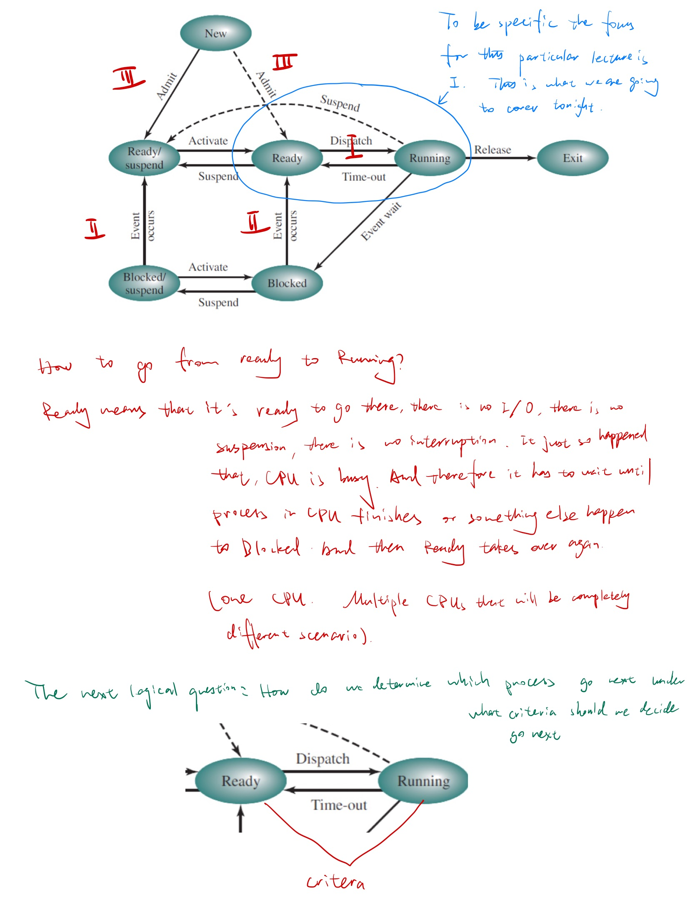
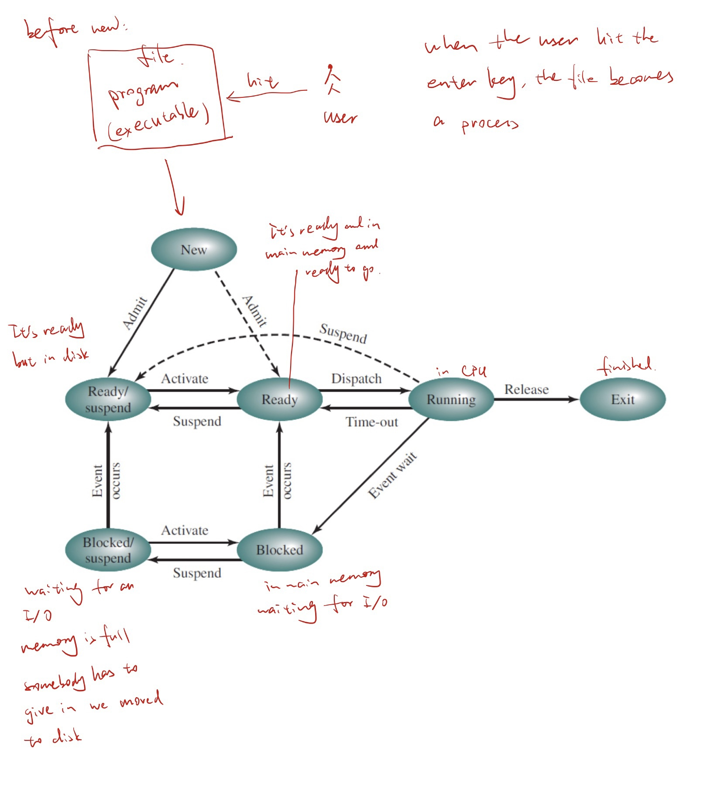
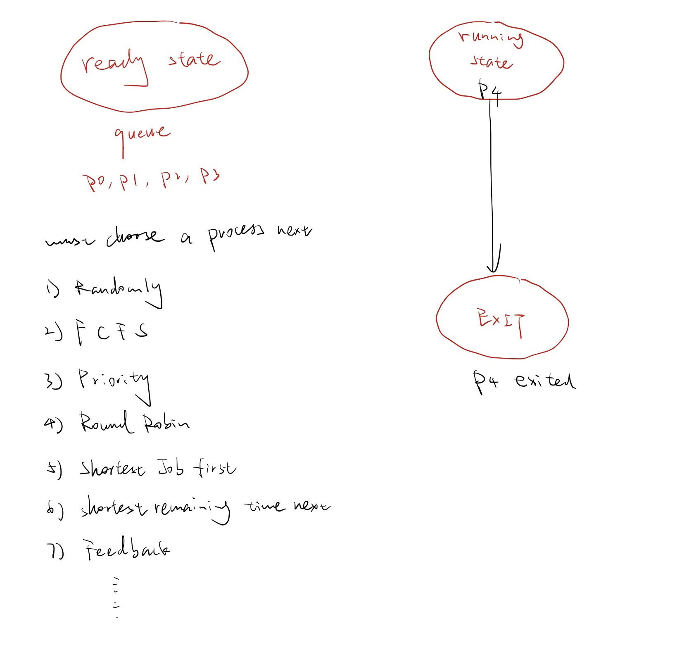
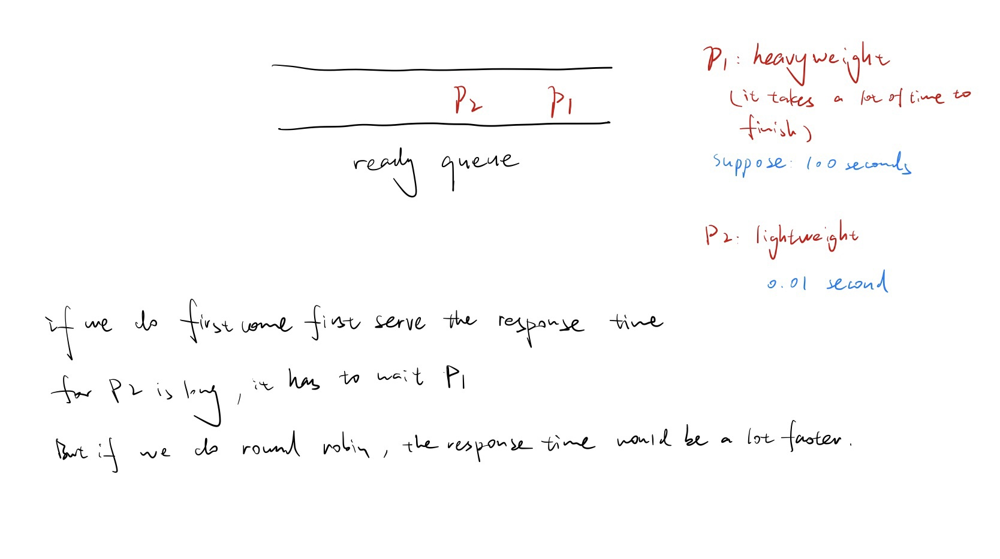
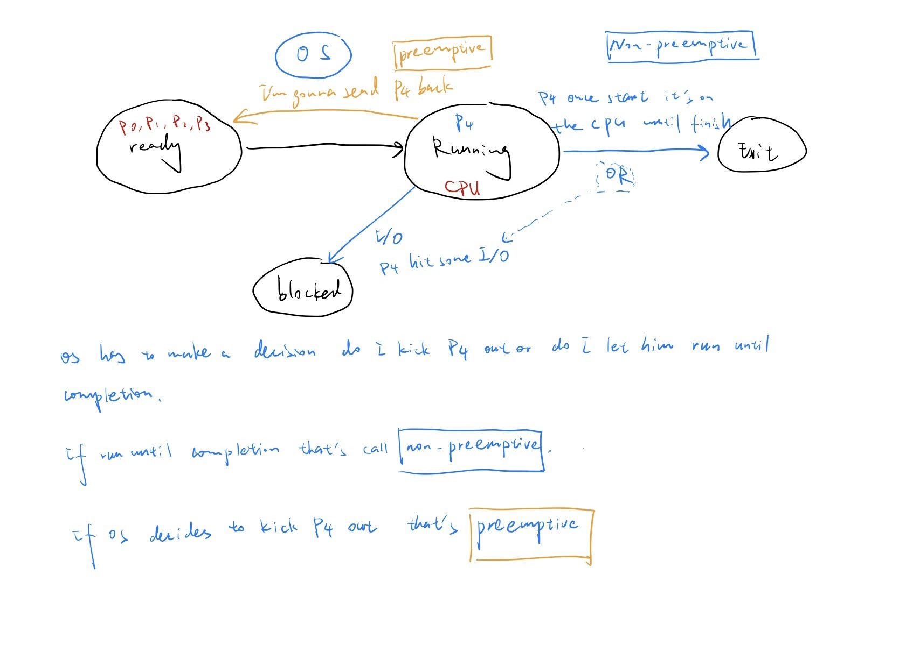
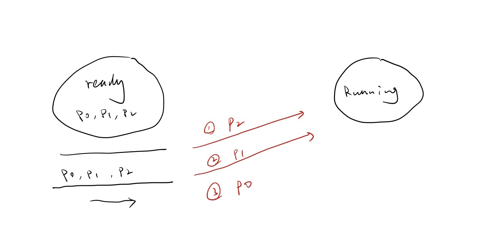
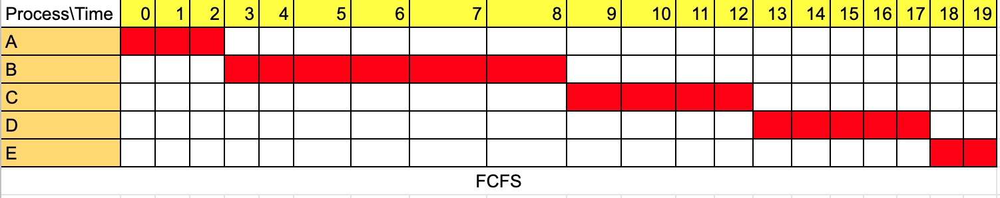
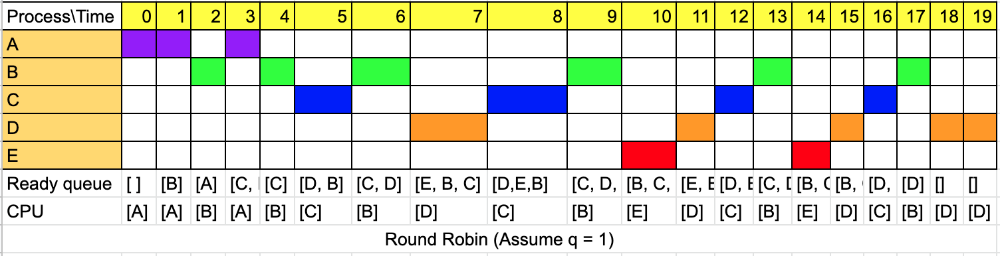
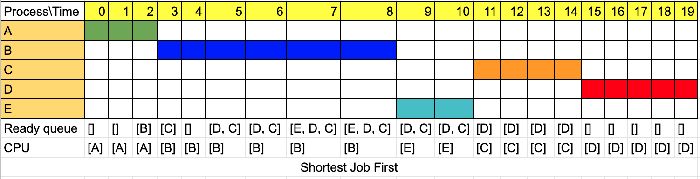

# Lecture 4

Feb-16-2023 Mid-exam after Spring break almost March 10

### Review

Reviews: OS overview

**OS - Definition of what OS is:** It is a program that **<u>manages computer resources</u>** in a secure manner where all processes have a fair access to these resources and these processes terminate within a reasonable amount of time.

A **process** is a program in execution. User interact with computer through process or through threads. These are two ways users interact with the computer.

**Thread**: Thread is light weight process in which several threads share common resources, such as data, files ... .

For example: Write some code I want to run Microsoft word and once they submitted to the computer it's a process because when you hit Ctrl Alt Delete and you go to the task manager you see all things that are running in the background, those are all processes. A process is a very heavy demanding entity. Sometimes you want a little bit of workers that assist it those are called threads.

**What are the resources that the OS must manage? (From the OS-definition) The question can be quested in another way: What is inside a computer?**

In a very simplistic architecture (this is how a computer looks like):

The intent of this course is to basically discuss how OS manages CPUs, how OS manages memories, how OS manage disks and how the security is also done. OS managing resources in an efficient and secure manner.

## Chapter 5 CPU Scheduling

The scope is to discuss uniprocess scheduling only. Multi process (aka multicore scheduling is out of scope)

### **CPU scheduling**

####**Question 1: What to schedule?** 

Answer: Processes -> Threads

####**Question 2: When to schedule?** 

**Answer:** 

1. When a process is in the **ready** queue. [short term scheduling]
2. Whenever a process is blocked no more. (When a process is blocked: it is residing in main memory and it's waiting for an I/O and the I/O has been granted, so now it has to go back and start execute). [medium term scheduling]
3. Whenever a process is not suspended any more. (If a process is suspended it is residing in disk) [medium term scheduling]
4. Whenever a new process is created; [long term scheduling]
5. Whenever a process exits. 

> Which one is you have do it right away
>
> Which one is that you have time to do it
>
> Which one you have more time to do it based on the criteria 
>
> 1. is short term scheduling 
> 2. and 3. is medium term scheduling 
>
> 5. implies [1. short term scheduling]

#### **Question 3: How do we determine which process go next under what criteria should we decide go next?**

##### **Scheduling Criteria** 

**What criteria do we use to compare and decide which scheduling schema do we use?  In other words, suppose we have Algorithm 1, and Algorithm 2 must use criteria to decide which one is better and why?**

For example: We could choose a randomly a process from the ready queue to run or choose a first come first serve process (it's also a queue). 

Basically, we have the ready state and we have the running state and exit state. Ready state here we have queue, process 1, process 2, process 3. It just so happened that P4 was running and P4 finished and P4 exited. Must choose a process next. There are two ways: 

* Randomly 
* FCFS
* Priority
* Round Robin 
* shortest job first
* shortest remaining time next 
* Feedback
* .......

We have to decide which so we need criteria. 

#### **Criteria** 

(By the way most of this stuff here is not in the textbook, so the notes will be the best source. Something is in the textbook but it's not in same way and there's much more here than textbook.).

1. Turn around time: time needed submission to completion including wait time and execution time.
   $$
   wait \ time + excution \ time
   $$
   And the goal for any CPU scheduling is minimize the **wait time**. If we do it randomly, we cannot minimize the wait time. First come first serve is insensitive, it doesn't matter you could be needing just one second, but if somebody is ahead of you that needs 100 seconds, they're gonna go first and you will have to wait. So it is insensitive it's basically fair. 

2. Response time: Some output is shown:

   

3. Throughput: maximize the number of processes completed per unit time. 

4. Processor utilization: maximize the percentage of time the CPU is busy.

5. Fairness:  everybody gets a fair reasonable time of the CPU.

   Fairness implies two types of scheduling algorithms:

   (1) Non-preemptive scheduling 

   (2) Preemptive scheduling   

   

   Non-preemptive scheduling will easier to design, but not fair because if p1, p2, p3 just takes 0.01 seconds, p4 takes 50 seconds. In 50 seconds I could probably finish p1, p2, p3.

   

####**How or what are the uni-processor scheduling Algorithms?** 

1. First come first serve (FCFS) [Non-preemptive]
2. Round Robin [preemptive]
3. Shortest Job First (SJF) [Textbook called it] or shortest Process Next (SPN) [Non-preemptive]
4. Shortest Remaining time (SRT) [preemptive]
5. Highest Response Ratio Next (HRRN)           
6. Feedback: aging priority scheduling Algorithm. [preemptive]

P.S. 5 and 6 are not in the textbook.

#### ==**Uni-processor scheduling Algorithms**==

1. **First come First serve (FCFS)** 

   The worst. First Jobs in the ready goes first (take the CPU first)

   

   Process Scheduling Example

   * Example set of processes, consider each a batch job

     | Process | Arrival Time | Service Time |
     | ------- | ------------ | ------------ |
     | A       | 0            | 3            |
     | B       | 2            | 6            |
     | C       | 4            | 4            |
     | D       | 6            | 5            |
     | E       | 8            | 2            |

     * Service time represents total execution time

     Let's say process A arrived at midnight 0, process B arrived at 2 am, process C arrived at 4 am, process D arrived 6 am, process arrived 8 am. Service time is how much time it takes for that process to run. So process a estimated CPU time is three hours units, and so on.  

     
   
2. **Round Robin**

   The main weakness of FCFS is that short Jobs may have to wait for a long time. One way to solve this is using Round Robin. Each Job (Process) is given a CPU time slice. Once that time slice is up, the OS will preempt the process and move it back to the ready queue, as long as the running process is not blocked. The OS will then bring the next process from the ready queue and grant it access to the CPU. The preempted process is moved back to the end of the ready queue. (The ready queue actually won't empty, when the machine start it always have something in the background)

   

   Now there is only process A, A jump into running it took one seconds, there's nobody yet so and it's done so guess what OS says you have to go back A jump into ready queue. A keep jumping into CPU and at this time process B arrive. 

   If q = 6 then it actually is FCFS

   In the mid-term the professor will change the $q = 1$ into $q = 2$ (time slice) or other question like when round robin will coincide with FCFS, the answer is what the quantum is as equal as what when the time slice is as equal as the longest service time.
   
   

3. **Shortest Job First (Non-preemptive)**

   The most efficient, gives the **best CPU utilization and response time and turn around time and the minimum waiting time**, but the most difficult to use: the OS chooses from the ready queue, the process that requires the least shortest process time.

   Major Drawback: No way to know a head of time how much time is needed.

   OS is a work with heuristics, it's not 100 algorithms, so in this case you know to get an estimate of how long this job is going to take, in other words, do some <u>**statistics**</u> based on history. 

   

