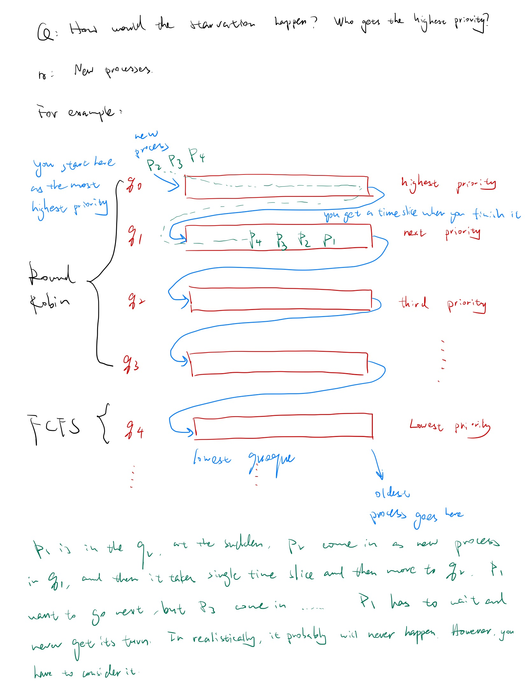

# Lecture 5

Feb-23-2023

Mid-term: after spring break


### Review: 


We discussed a few CPU: scheduling Algorithms that apply to **<u>short term</u>** scheduling:

(1) Short term scheduling 

(2) Mid term scheduling

(3) Long term scheduling


**CPU scheduling:** 

1. FCFS: Non-preemptive, the longer waiting goes next

2. Round Robin: Preemptive, time slice.

3. Shortest Process Next (SPN) or Shortest Job First (SJF): Non-preemptive

    The one with the least service time.

4. Shortest Remaining Time (SRT): Preemptive

5. Highest Response Ratio: Non-preemptive

6. Feedback: preemptive


### Shortest Remaining Time

Shortest Remaining Time (SRT): Preemptive

We recall the SJF is the best in term of responded time and throughput, but its major weakness is that we must predict the future. We have to know in advance how much processing time for a given job. Guess work. Practice is not possible. 

(If you're writing a program say in Java and execute, do you know how much time it is going to take? you don't. Only statistically if you do so many times you'll be able to guess.)


Shortest Process time or SRT is a policy in which the process with the shortest expected remaining time  goes next. This is a preemptive algorithm. That is, if a new process. Joins the ready queue, with processing time that is less than the remaining process time that is currently running, then the new process will take over the CPU and the current process is preempted.


Example set of processes, consider each a batch job

| Process | Arrival Time | Service Time |
| ------- | ------------ | ------------ |
| A       | 0            | 3            |
| B       | 2            | 6            |
| C       | 4            | 4            |
| D       | 6            | 5            |
| E       | 8            | 2            |


### Highest Response Ratio (HRR)

Highest Response Ration: Non-preemptive

We use a ratio that determines which process goes next. But must be fair: a process that has been waiting for a long time must be consider before a process that is waiting for a shorter time. **(FCFS)**.

On the other hand: a Job that is small should be also considered. 

- waiting time is a factor. (FCFS)
- service time is a factor. (SJF/SPN)

The definition of  service time: the time it takes for the whole job to run 

Maximize: Throughput. Number of processes that have completed pair amount of time if I can finish 100 jobs in an hour obviously it's better than only 70 right.

If I only do FCFS, the throughput is going to be low, for example: 


Solution: Ratio


#### Ratio

Let us come up with a ratio: The higher the ration of a process, the first it acquires the CPU. Must consider wait time + service time. The longer you wait should go first.
$$
ration \ (R)= \frac{time \ spent \ waiting + expected \ service \ time}{expected \ service \ time}=\frac{w+s}{s}
$$
(1) If $w$ is big $R$ is big.

(2) If $s$ is small $R$ is big.


R is non preemptive policies, so it basically takes the best of FCFS, shortest job first. A compromise between two.


### Feedback

Round Robin, priority based, multi queue policy preemptive with possible case of starvation and with the least queue is FCFS based.

$q_0,q_1,q_2,q_3,q_4$ are all ready queue.


**starvation**: a process will never get its turn, it will wait indefinitely.




##**==Important!!!==**

mid term also


*w* = time spent in system so far, waiting

*e* = time spent in execution so far

*s* = total service time required by the process, including *e*; generally, this quan- tity must be estimated or supplied by the user

For example, the selection function max[*w*] indicates an FCFS discipline.


## Chapter 6 Synchronization Tools

Important: 6.1; 6.2; 6.3; 6.6; 6.7

Read: 6.4; 6.5; 6.8; 6.9


### Q: What do we mean by synchronization

A: We have processes, Threads, multiprogramming, multi processing, distributed processing, which are pretty **fancy** but also it adds another level of **complexity** and also forces us to do **complex communications**.  

We have two choices: We can have processes only **work in silos** or have **work** **cooperate** and **communicate**. 

possible that they run on each other to each other, or might result in miscommunication or step on each other unless we have synchronization enforced. OS does synchronization enforced.


### Critical-Section

**Q: Did we see this before ? Did we see a conflict before?** 

Yes. HW2

```pseudocode
const int n = 50;
int tallyl
void total()
{
	int count;
	for (count = 1; count <= n; count++){
		tally++;    
	}
}
void main()
{
	tally = 0;
	parbegin (total(), total());
	wrtie(tally);
}
```

We have two threads. `tally` output was unpredictable. Sometimes is 2, sometimes is 50, sometimes is 100... Because there was no synchronization. `tally++` is shared and modified by two threads independent of each other. If we have synchronization we would't have that kind of issues, we would be getting the consistent output all the time.

`tally++` in OS can be called critical section it's something that has to be protected. That's why we need synchronization around it. The critical section must be protected only one thread can execute it at any given time. This is the only way that it will guarantee for us to get the correct results.


**The critical-section problem**

```ps
do {
		[entry section]       ---> must protect here
		
				critical section				--> tally++
		
		[exit section]				---> must protect here 
				
				remainder section

}while (TRUE);
```

Protect means synchronized, in such a way only one thread  can access this section at any given time.

Chapter 6 and 7 goes around how do we do it?

Have to make sure that my solution does give fair access to both of them without any conflicts. 


##Synchronization

**synchronization can be done in several ways:**

1. **Programming level**

   We program it. The user does the synchronization. Most difficult.

2. **Hardware Level**

   We have machine instructions that does the synchronization. Easy but limited.

3. **Programming Languages Constructs**

   Programming constructs does the synchronization. Most general but of course complex.

   


cars: processes or threads 

The bus represents it's going to take a lot of service time, first come first service. 

The little motorcycle or bicycle: shortest job first (sjf)

Q: What is the critical section here?

A: intersection

Q: What is the way to solve it?

A: like policeman or traffic light. Semaphores

