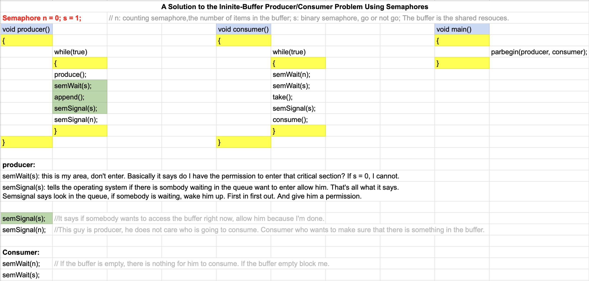
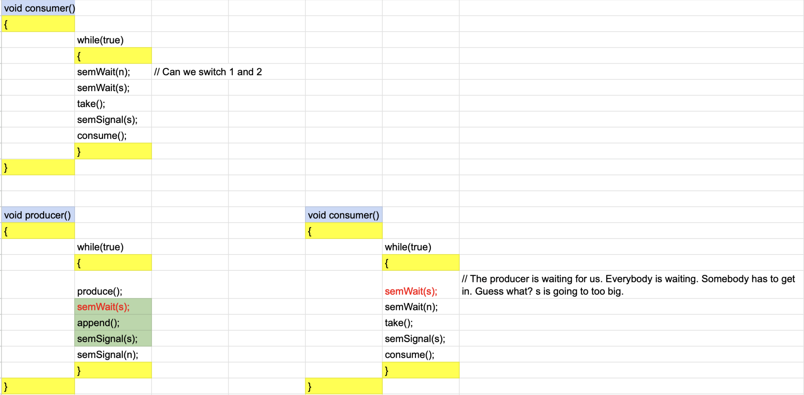

# Lecture 8

March 23 2023

#### Announcements:

Test-midterm next week: between 1 hour 30 mins and 2 hours max

You can bring as many cheat sheets as you like. All cheat sheet must hand copy. No electronic devices will allowed. No calculator.

Test will be based on the notes supplemented by required sections and reading sections as outlined.

Grader number: 972-363-9214


Any students needs special assistance must contain the instructor as soon as via email.

Test will cover: 

Chapter 1, 2, 3, 4, 5, 6, 7 

Possibly chapter 8 if covered today.

Chapter 7: 7.1.3 is important. The rest read.


### Quick Recap:

The objective of this class:  is a relatively in-depth study of the parts that form an operating system.

Operating is a program that manages computer resources in an efficient and secure manner in a concurrent environment where resources are shared, processes are concurrent.

Fundamental concepts: Processes  + Thread.

<span style="color:red">**Processes: a program in execution.** </span>

<span style="color:red">**Thread: a lightweight process where by a thread shares all of the date of the parent process.** </span>


OS is about <span style="color:green">**managing**</span> Process and <span style="color:red">**Resources**</span> in a concurrent manner. 

<span style="color:red">**Resources:** CPU, Memory, Disks, Auxiliary Devices (Disk, USB)</span>

<span style="color:red">**CPU: CPU scheduling :FCFS, RR, SJF, STR, Priority ... **</span>

Because of concurrency and limited shared resources, we had to address the problem of <span style="color:blue">**who access what and when** </span>. If we don 't than the processes will step on each other is way and modify shared resources:

$\rightarrow$ Critical Sections Problem and how to solve.


How do we solve Critical section?

* Programming Level: <span style="color:red">Peterson Algorithm</span> (User)

* Handware Level: <span style="color:red">Hardware instructions.  </span>(Machine)

* Programming Language Level: <span style="color:red"> Constructs</span> (Language)


==Q: If I have programming Level and Hardware Level why we need programming language Level here? Why bother?==

A: Peterson Algorithm: <span style="color:green">**Limited** </span>(to two processes and it is difficult) and <span style="color:green">**burden on user.** </span>

Hardware instructions: Harder when dealing with multicores. 

Constructs: Two options:

* Semaphores: (Fine control synchronization, complex)
  * Binary Semaphores
  * Counting Semaphores
* Monitors: (General control synchronization but very easy )
  * Each object has a Lock. Once this lock is acquired by a thread, no one else can use it.


### Semaphores:

* Binary Semaphores
* Counting Semaphores

A Binary Semaphores is a semaphore that takes the values of 0 and 1. 

A Counting Semaphores may initialized to any non-negative integer value.

**Example:** 

Synchronization of shared resources using counting semaphores. Producer/Consumer Problem.

The Producer generate data and deposits them in a buffer. 

The Consumer retrieves the data and Consumes it.

<span style="color:red">**Synchronization Problem**: Why? </span>

<span style="color:red">Buffer is shared</span>

How to solve it?


**==Mid-term Exam==**




**In consumer(), can we exchange semWait(n) or semWait(s) Why?**



Semaphore give you extremely fine control, but you put the right order and the code. If you write a code with three or four semaphores 99.9999% you're going to deadlock. You are waiting for somehting to happen. And it does and it never happens because you misplaced thoese semaphore weights and signals.


### Monitor

Mutual Exclusion and Synchronization in Java (PPT)


#### Java and Monitors

* Java implements (a restricted) Monitor abstraction.
* You can declare a class and have it behave like the monitors we described in the previous set of slides.
* <span style="color:red">**Each Java Object has a monitor within it.** </span>
  * There is no "Monitor" class since the Object class incorporates the functionality of a monitor
    * Actually there is, but for "Managed Beans"
* Some of the object's methods can be declared <span style="color:red">**synchronized**</span>
  * A class can have both synchronized and non-synchronized methods
* Synchronized methods are executed in mutual exclusion
  * In other terms, synchronized methods are the monitor's methods as well as the object's methods.
* Each Java monitor has <span style="color:red">**one**</span> condition varibale 
  * In the previous set of slides we considered multiple condition variables per monitor.
  * In Java, since there is only one, it's not even declared/accessible (it has no name)
* Operations on the condition variable are:
  * <span style="color:red">**notify();**</span>
  * <span style="color:red">**notifyAll();**</span>
  * <span style="color:red">**wait();**</span>
  * Always used inside a synchronized method
* Let's look at a simple example.


#### Synchronized Methods

```java
public class SomeClass{
  public synchronized void SomeMethod(){ //As soon as you put the word synchronized here,
    ...								// All what you are saying that the code here is the critical section.
      								// Nobody can acccess it, but only one thread at any given time.
      								// So there is no semWait, semSignal. All we need to do is that this 
      								// is syncrhonized. So let's suppose that five threads want to access 
      								// this method here. Only one will be given the permission to do so.
  }
  
  public synchronized void SomeOtherMethod(){
    ...
  }
}
```

* Number of current activations of SomeMethod() + number of current activations of SomeOtherMethod() <= 1at all times.
  * Coarse-grain mutual exclusion (It's a Monitor)
  * Implemented internally with a single lock


Example

```java
public class Counter{
  private int value;
  public Counter(){
    value = 0;
  }
  
  public synchronized void increment(){
    value++;
  }
  
  public synchronized void decrement(){
    value--;
  }
  
  public synchronized int getValue(){
    return value;
  }

```

```java
Counter counter = new Counter();
// Thread 1
...
counter.increment();
...
  
// Thread 2
...
counter.decrement();
...
```

* Class counter is a monitor
* It is thread-safe
* Class users do not have to worry about anything.


#### Synchronized Statements

* It is not always convenient to have an entire method be used in mutual exclusion
  * Perhaps there are only a few "critical" statements in the method
  * And in fact, we have seen that the shorter the critical sections the better
  * The section could be to put the critical statements in their own methods
  * But then we artificially create more method calls 
  * Which in turns harms performance
* As a result, Java provides ways to have synchronized statements inside non-synchronized methods

```java
public class Counter{
  private int value;
  public Counter(){
    value = 0;
  }
  
  public void increment(){
    System.out.println("hello");
    synchronized(this){    // We are not synchronized the whole message. 
      value++;						 // Only synchroning the access to this valuable right here.
    }
    // do some other thing
  }
  
  ...
}
```

* Two threads can print "hello" at the same time
* But only one can increment the value at a time
* The synchronized (this) statement makes it possible to make short critical sections and thus maximize concurrency.


#### Only One Monitor?

* Having only one monitor per object can be a problem
* Say you define a class in which not all methods need to be in mutual exclusion, but only some of them
* Example:
  * Methods f1() and f2() should be executed in mutual exclusion
  * Methods f3() and f4() should be executed in mutual exclusion
  * But f1() and f3() can be executed concurrently


Example: Two Counters

```java
public class TwoCounters{
  private int value1, value2;
  public TwoCounters(){
    value1 = 0; value2 = 0;
  }	
  
  public void increment1(){
    synchronized(this){
      value1++;
    }
  }
  
  public void increment2(){
    synchronized(this){
      value2++;
    }
  }
}
```

* This solution is correct, but overrestictive
* Two threads should be allowed to update two different counters simulaneously
* This is similar to the "reader/writer" problem in which we wanted some threads to be in mutual exclusions and some not to be
* In this case, with a single monitor there is no way to do this.
* Therefore, we need to have multiple monitors
* Problem: The TwoCounters object has only one monitor


#### Synchronizing on Multiple Objects

* When synchronizing statements one uses the synchronized(this) statement
* The "this" specifies that one uses the monitor of the current object
* This is standard, but in fact one can synchronize on the monitor of any object
* This is really against the definition of a monitor we saw previously
  * The whole point was that everything was encapsulated within a single monitor object
* But it's necessary to achieved higher concurrency as in the previous example.

```java
public class TwoCounter{
  private int value1, value2;
  private Object lock1, lock2;
  
  public TwoCounters(){
    value1 = 0; value2=0;
    lock1 = new Object();
    lock2 = new Object();
  }
  
  public void increment1(){
    synchronized(lock1){
      value1++;
    }
  }
  
  public void increment2(){
    synchronized(lock2){
      value2++;
    }
  }
}
```

* Now we have a distinct monitor for each counter
* Note that these monitor are encapsulated within Object objects
* I name these objects lock1 and lock2 just to remind myself that they are used exclusively for mutual exclusion
  * I could have used any object in the program really, but it's typically not very readable
* Some programmers find this confusing, but you only have to remember that all Java objects incorporate a monitor.


#### Synchronized Class

* So far, we have seen mutual exclusion over objects, i.e., instances of classes
* Sometimes one wants a particular method to be in mutual exclusion over all instances of the class
* Example: only one of the counter objects in the whole program can update some global sum of all the counters
* One way to do this is to encapsulate the global sum in its own class, with its own monitor
* Another way is to declare a "class method", i.e., a static method, as synchronized
* Let's see an example

Example:

```java
public class Counter{
  private int value;
  static private int sum = 0;
  
  public Counter(){
    value = 0;
  }
  
  public void increment(){
    synchronized(this){value++;}
  }
  
  public static synchronized void updateSum(){
    sum += value;
  }
}
```

* Only one Counter object can update the sum class variable at a time.


#### Wait/Notify in Java

* Since each Java object has a monitor, each object also has a condition variable
* Each Java object inherits three methods from the Object class 
  * Wait(): the calling thread blocks
  * notify(): unblock the first blocked thread
  * notifyAll(): unblock all blocked threads
* These three methods must be called within synchronized methods/blocks
* In good condition variable fashion, when a thread calls wait() it releases the lock on the object
* When a thread call notify() is keeps the lock and continues executing
  * Since it is in a synchronized method/block
* The awakened thread(s) will require the lock whenever possible.


**Example**

```java
public class Mythread extends Thread{
  public void run(){
    while(true){
      synchronized(this){
        this.wait()
      }
      System.out.println("Awakened");
    }
  }
}
```


```java
...
MyThread thread = new Thread();
thread.start();

while(true){
  Thread.sleep(1000);
  synchronized (thread){
    thread.notify();
  }
}
...
```

`notify()`: if you have a waiting threads in the list, one of them will be woken up and it will be given. Which one, it's up to the gvm.

`notifyAll()`: Wake them all up.

